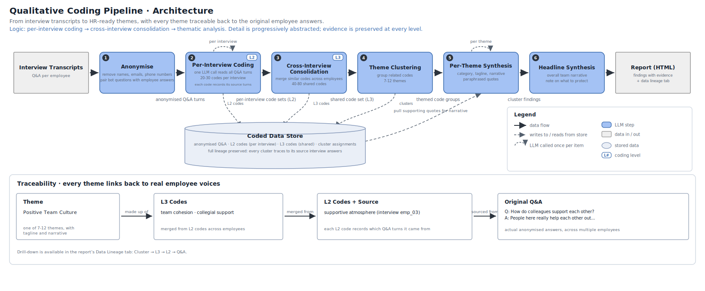

# Spradley — Qualitative Interview Coding Pipeline

Automated open coding of employee interviews using an LLM, following grounded theory principles. Raw transcripts go in; thematic clusters with full source lineage come out.



---

## How it works

The pipeline processes employee interview transcripts through six sequential LLM-assisted stages (numbered in the figure above). All intermediate outputs are persisted as JSON to `pipeline_output/` after each stage, enabling any stage to be re-run in isolation.

**Stage 1 - Anonymisation:** Raw transcripts are loaded from a CSV file and paired into question-answer turns by matching each employee response to the preceding bot-generated question. A rule-based PII scrubber removes names, email addresses, and phone numbers via regular expression matching before any data is stored or sent to the LLM.

**Stage 2 - Per-Interview Coding (L2):** A single LLM call reads all Q&A turns for one interview and generates 20-30 inductive open codes (2-5 word noun phrases) that collectively cover all substantive topics raised. Each code records the IDs of the Q&A turns that support it, establishing the primary traceability link. A polarity constraint in the prompt requires that positive and negative framings of the same topic produce distinct, direction-specific code labels. This stage repeats independently for each interview.

**Stage 3 - Cross-Interview Consolidation (L3):** All per-interview code sets are passed in a single LLM call that merges semantically equivalent labels and produces 40-80 globally shared codes. The model is instructed to treat input order as arbitrary, preserve polarity separation, and normalise synonymous labels before merging. Each L3 code retains a list of the L2 codes it absorbed.

**Stage 4 - Theme Clustering:** The shared L3 code set is grouped into 7-12 named thematic clusters in a single LLM call. Cluster names are specified as concrete, title-case 3-6 word headers. A constraint in the prompt prohibits placing codes that reflect opposite experiences in the same cluster.

**Stage 5 - Per-Theme Synthesis:** For each cluster, a structured LLM call generates: a category assessment (`working_well`, `mixed`, or `needs_work`), a one-sentence tagline, a 3-5 sentence analytical narrative grounded in the source Q&A, and 2-4 paraphrased representative quotes with identifying details removed. For clusters categorised as `needs_work` or `mixed`, a separate call proposes 2-4 actionable experiments with observable success criteria.

**Stage 6 - Headline Synthesis:** A final LLM call reads all cluster findings and produces a 2-3 paragraph opening narrative contextualising the overall team picture, followed by a closing reflection identifying what in the data is worth protecting. These frame the report without duplicating the per-cluster narratives.

**Traceability:** Every output level records its provenance. Each L3 code lists the L2 codes it absorbed; each L2 code lists the Q&A turn IDs that support it. This produces a four-level lineage chain -- Cluster to L3 to L2 to Q&A -- navigable in the report's Data Lineage tab.

| Coding level | Scope | Typical range |
|---|---|---|
| L2 | Open codes per interview (direct) | 20-30 |
| L3 | Consolidated codes across all interviews | 40-80 |
| Clusters | Thematic clusters | 7-12 |

---

## Architecture


Each numbered stage corresponds to one or more notebook cells (C0-C13), keeping stages independently re-runnable. State is held in Python dicts in memory and written to JSON after each stage completes.

---

## Setup

```bash
python -m venv .venv
.venv\Scripts\activate        # Windows
pip install -r requirements.txt
python -m ipykernel install --user --name=spradley-venv --display-name "Python (Spradley)"
```

Create `keys.env` in the project root (never committed):

```
ANTHROPIC_API_KEY=sk-ant-...
```

---

## Running

Open `Pipeline_Execution.ipynb`, select the **Python (Spradley)** kernel, and run cells **C0 → C13** in order. Each cell is self-contained and can be re-run independently after adjusting config in C0.

### Output files

| File | Contents | Committed |
|------|----------|-----------|
| `pipeline_output/db.json` | Per Q&A turn store: anonymised question and answer, keyed by turn ID | No (gitignored) |
| `pipeline_output/interview_store.json` | L2 codes per interview with source turn IDs | No (gitignored) |
| `pipeline_output/global_store.json` | L3 codes with merge lineage from L2 | No (gitignored) |
| `pipeline_output/lineage.json` | Full chain: cluster to L3 to L2 to Q&A turn ID | No (gitignored) |
| `pipeline_output/clusters.json` | Final clusters with headline, summary, quotes, category | No (gitignored) |
| `pipeline_output/experiments.json` | Proposed experiments for needs\_work and mixed clusters | No (gitignored) |
| `pipeline_output/report.html` | Standalone report, served via GitHub Pages | Yes |
| `pipeline_output/eval_report.html` | Eval results report with per-eval detail and Q&A traceability | Yes |
| `pipeline_output/eval_results.json` | Latest eval run results (auto-restored on next E0 run) | No (gitignored) |
| `pipeline_output/eval_cache.json` | Cached LLM calls for E6a and E8 (paraphrase + negation) | No (gitignored) |
| `pipeline_output/eval_history/` | Full snapshots per eval run (JSON + rendered HTML) | No (gitignored) |

---

## Swapping the LLM

Change `LLM_PROVIDER` and `LLM_MODEL` in cell **C0**. The client implementation lives in `pipeline_core.py` (search `# C2`); uncomment the alternative provider branch there. No notebook cells need to change.

---

## Evaluating the pipeline

Open `Pipeline_Evals.ipynb` and run cells **E0 to Final** in order. It reads from `pipeline_output/` (no re-runs of the main pipeline needed) and writes `pipeline_output/eval_report.html`.

### Eval cells

| Cell | Name | What it tests |
|------|------|---------------|
| E0 | Setup | Loads pipeline outputs; auto-restores `eval_results.json` from the last run |
| E1 | L2 Code Stability | Reruns L2 coding N times per interview; measures cosine soft-Jaccard (gate >= 0.6) |
| E2b | L2 Label Quality | Claude judge checks each L2 label against its source Q&A turns |
| EL | Lineage Integrity | Checks that every cluster code traces back to at least one Q&A pair |
| E4 | Clustering Stability | Reruns L3 clustering N times; measures pairwise ARI (gate >= 0.7) |
| E5 | Faithfulness | Claude judge checks cluster narratives are grounded in source Q&A |
| E5b | Sentiment Overclaim | Claude judge checks narratives do not overstate positive or negative sentiment |
| E6 | Metamorphic Invariance | Paraphrase robustness (gate >= 0.5) and order invariance (gate >= 0.7) |
| E7 | Re-identification Probe | Adversarial Claude tries to re-identify employees from the report |
| E8 | Negation Sensitivity | Negates polarity-bearing answers; checks codes change accordingly (gate >= 60%) |
| Final | Report | Generates `eval_report.html` and saves a full history snapshot |

### Restoring a previous run

E0 auto-restores from `eval_results.json` on kernel start. To load a specific historical run, set `HISTORY_RUN` at the top of E0:

```python
HISTORY_RUN = "2026-06-23T14-30-00"  # paste a timestamp from the history-list cell
```

Run the history-list cell (just below E0) to see all available timestamps.
