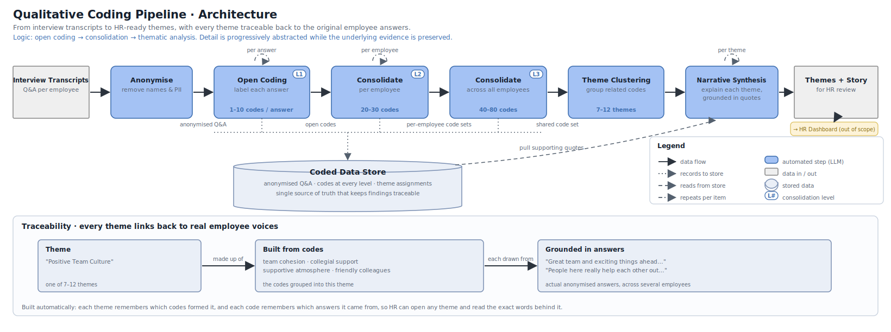
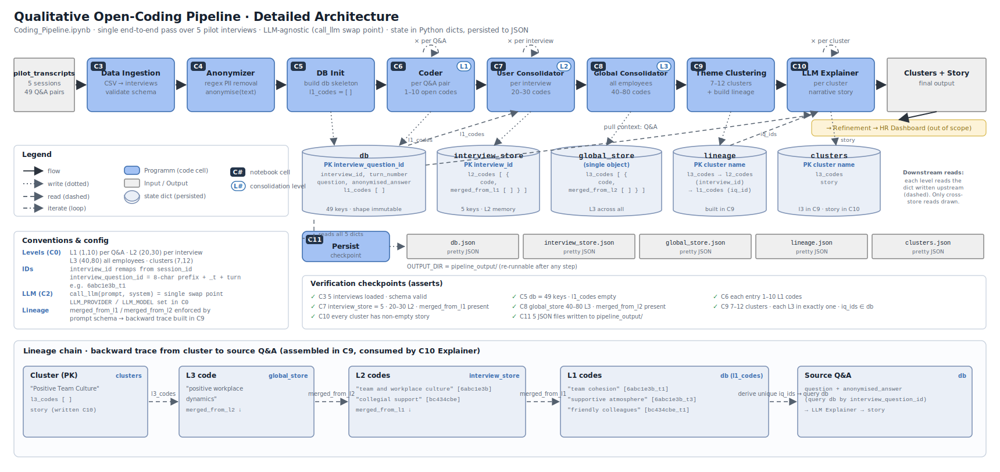

# Spreadley — Qualitative Interview Coding Pipeline

Automated open coding of employee interviews using an LLM, following grounded theory principles. Raw transcripts go in; thematic clusters with full source lineage come out.



---

## How it works

The pipeline processes interview transcripts in four stages:

**1. Ingest & anonymise** — Transcripts are loaded from a CSV, paired into question–answer turns, and scrubbed of PII (names, emails, phone numbers) before anything is stored.

**2. Open coding (L1 → L2 → L3)** — The LLM reads each Q&A pair and generates 1–10 inductive codes grounded in the employee's exact words (L1). These are then consolidated per interview into 20–30 broader codes (L2), and finally merged across all interviews into 40–80 global codes (L3). Every merge step records which source codes it absorbed, keeping the lineage intact.

**3. Theme clustering** — The L3 codes are grouped into 7–12 named thematic clusters. Each cluster is assigned a narrative story written by the LLM, grounded in the original Q&A pairs that fed into it.

**4. Persist** — All data structures are written to `pipeline_output/` as JSON, including the full lineage chain from cluster name down to the original interview question ID.

| Coding level | Scope | Range |
|---|---|---|
| L1 | Open codes per Q&A pair | 1–10 |
| L2 | Consolidated codes per interview | 20–30 |
| L3 | Global codes across all interviews | 40–80 |
| Clusters | Thematic clusters | 7–12 |

---

## Architecture



Each box in the diagram corresponds to a single notebook cell (C0–C12), keeping stages independently re-runnable. State is held in Python dicts (`db`, `interview_store`, `global_store`, `lineage`, `clusters`) and persisted to JSON after each run.

---

## Setup

```bash
python -m venv .venv
.venv\Scripts\activate
pip install -r requirements.txt
python -m ipykernel install --user --name=spreadley-venv --display-name "Python (Spreadley)"
```

Create `keys.env` in this directory (never committed):

```
ANTHROPIC_API_KEY=sk-ant-...
```

---

## Running

Open `Coding_Pipeline.ipynb` and run cells **C0 → C12** in order. Each cell is self-contained; re-run any stage independently after adjusting config in C0.

### Output files

| File | Contents |
|------|----------|
| `pipeline_output/db.json` | Per Q&A store: anonymised answer + L1 codes |
| `pipeline_output/interview_store.json` | L2 codes per interview (with merge lineage) |
| `pipeline_output/global_store.json` | L3 codes across all interviews (with merge lineage) |
| `pipeline_output/lineage.json` | Full chain: cluster → L3 → L2 → L1 → Q&A ID |
| `pipeline_output/clusters.json` | Final clusters with narrative stories |

---

## Swapping the LLM

Change `LLM_PROVIDER` and `LLM_MODEL` in cell **C0**, then uncomment the matching branch in cell **C2**. No other cells need to change.
